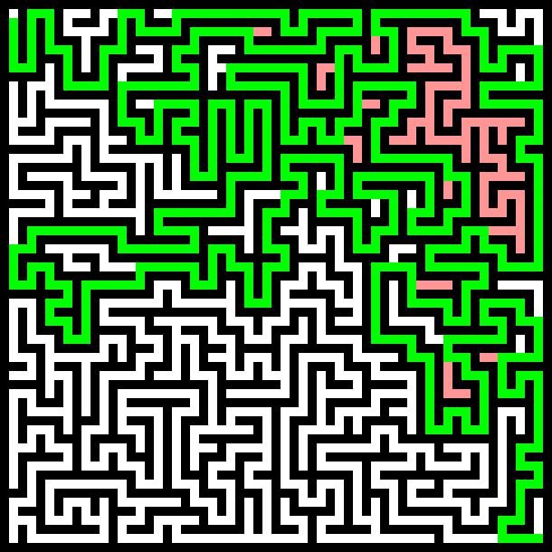

# Maze generator

It generates a maze like this:


And can solve it like this:



## Usage:

```
    -mw <int> Default: 10
        The width of the maze

    -mh <int> Default: 10
        The height of the maze

    -bs <int> Default: 5
        The size of a square in the maze in pixels

    -o <string> No default
        Path to the output bmp file. If this is set it will output a picture into the specified file of the maze.

    -h
        Prints out this help message
```
